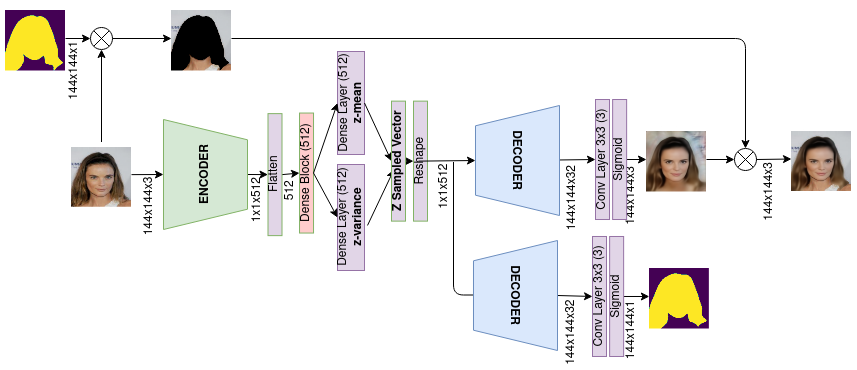
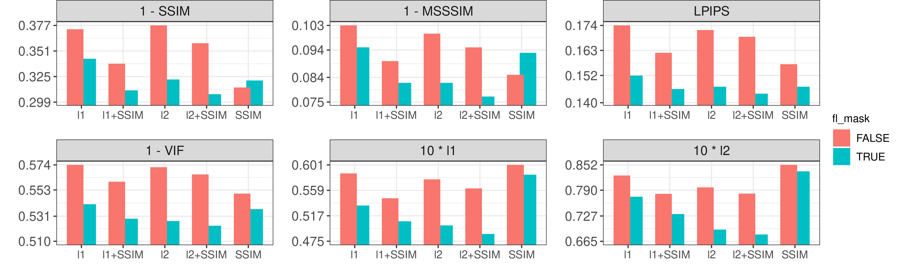

# Face Reconstruction with Variational Autoencoder and Face Masks

This repo holds the project presented on the paper **Face Reconstruction with Variational Autoencoder and Face Masks** for the [ENIAC 2021 Conference](http://c5ai.inova.usp.br/bracis/eniac.htm).

To check in more details how the ablation study was done, and how to use the code, see the Colab [notebook](https://colab.research.google.com/drive/1osCivEuO6U8OnLe9OInmd_qvSxL5S8YL?usp=sharing).

The final trained model for each hypothesis is available [here](https://drive.google.com/drive/folders/1ew-d7Dtu9gTe7vIoprSEPKNwESBmFeAJ?usp=sharing)

For environment compatibility, check the `environment.yml` out.  
  

## The Architecture Solution

The proposed architecture has a common VAE structure besides an additional decoder branch that predicts face masks. During training it uses face masks as labels too, which are used to replace the background of the reconstructed image such that the loss function is applied only on the face pixels. On the other hand, on the prediction mode the background replacement is made straightly by the predicted mask, not requiring any extra input but an image.  

## Dataset 

This project used the [CelebA](http://mmlab.ie.cuhk.edu.hk/projects/CelebA.html) dataset.  

The solution uses face masks during training. Although they are not required during prediction. For the masks extraction, I used the project [face-parsing.PyTorch](https://github.com/zllrunning/face-parsing.PyTorch). The masks data are available for downloading [here](https://drive.google.com/file/d/1BJsxPWnBWxYWHRqMrhjBj3f324SHhBQp/view?usp=sharing).  

## Results

### Do face masks help?

It is well noticed in the figure bellow that the presence of the mask-based architecture played a meaningful role for all metrics and losses combination, but the *SSIM* standalone cases (H5/H6), where "without face masks" performed better on the SSIM and MS-SSIM metrics; It's counter-intuitive for what we expected. However, if we regard LPIPS as a better perceptual metric than the SSIM ones, the hypothesis with face mask also worked better on H5/H6.  

*SSIM* standalone cases appeared less sensitive for the background information, while the addition of face masks was much more effective when $l_n$ losses were used.  

### Which standalone loss does work better?

Looking at the scenario with face masks, we were surprised how well $l_2$ did on perceptual metrics (SSIM, MS-SSIM, and LPIPS), being better or equal to $SSIM$; and on the other metrics, $l_2$ outperformed SSIM. Despite this, in the scenario without the face masks, $l_2$ performed far worse than SSIM for the perceptual losses.  

An interesting observation is that $l_2$ outperformed $l_1$ even on the $l_1$ metric. The takeaways found here are: $l_2$ usually performs better than $l_1$ on the face reconstruction task; the usage of face masks improves a lot the performance of $l_2$, working even better than the standalone SSIM on the overall of the metrics. But, without the mask addition, SSIM is far better on the perceptual losses.  

### Which $l_n$ does work better with SSIM?

It is known that SSIM was made to work with grayscale images, and it may present problems with color images. To improve the training process with the perceptual loss SSIM, we add a $l_n$ loss to help stabilize color issues that SSIM can raise.  

The figure bellow showed up two very distinct scenarios. Using the Mask-based approach, $l_2$ clearly surpasses $l_1$ in all metrics, but without the mask, $l_1$ obtained the best results.  

Probably, here is a case where the higher sensitivity of $l_2$ to outliers played badly. We assume the amount of information on the background can yield higher errors on $l_2$, attenuating the right gradients for the main task of face reconstruction.  

### Which hypothesis is the best?

We had the dominant hypothesis $H_9$ pointed on the table \ref{tab:exp_results}, it reached the best performance in all metrics. $H_9$ used the face mask, SSIM, and $l_2$ loss.  

Without masks, we didn't have a dominant hypothesis, for perceptual metrics, $H_5$ worked better with the standalone SSIM, and with regards to the $l_n$ metrics, $H_1$, which is SSIM + $l_1$ worked better.  

***
## Visual comparisons

All images presented here are unobserved samples from the testing set. Checking out the hypothesis outcomes, we noticed some patterns. Looking at first figure bellow, we see the blurred reconstructed hair, which is a recurrent issue with VAE. Although, it is possible to notice that the hypothesis with face masks got slightly sharper lines on the hair, especially on the column of the SSIM standalone.  

The SSIM standalone clearly had the crispest reconstructed samples, however, the colors presented on the face are the most distant from the original image, even they appearing brighter, they moved away from the original yellowish color. The hypothesis of SSIM + $l_2$ with face masks offered a more fidelity outcome.  

In the next figure , we noticed crisper samples in the SSIM hypothesis, but its color is shifted again, it moved away from the greenish presence of the original picture. The hypothesis with face masks preserved more the greenish, also the teeth as seen on the columns with $l_2$. In this figure, the hypothesis with SSIM + $l_1$ + face masks presented the best reconstruction of the original image.  

For the following figures, the hypotheses without face masks were blurrier, especially when $l_1$ and $l_2$ were used. In the figure \ref{fig:visual_3}, on the hypothesis SSIM standalone, the face skin color turned to magenta because of the lack of green, different from the original image. The hypothesis with $l_2$ and masks got better results.  

The figure bellow had a posing challenge, clearly, the usage of face mask or SSIM was important to accomplish good face reconstruction. Again only SSIM made the skin quite reddish, SSIM + $l_1$ showed a more proper solution.  

